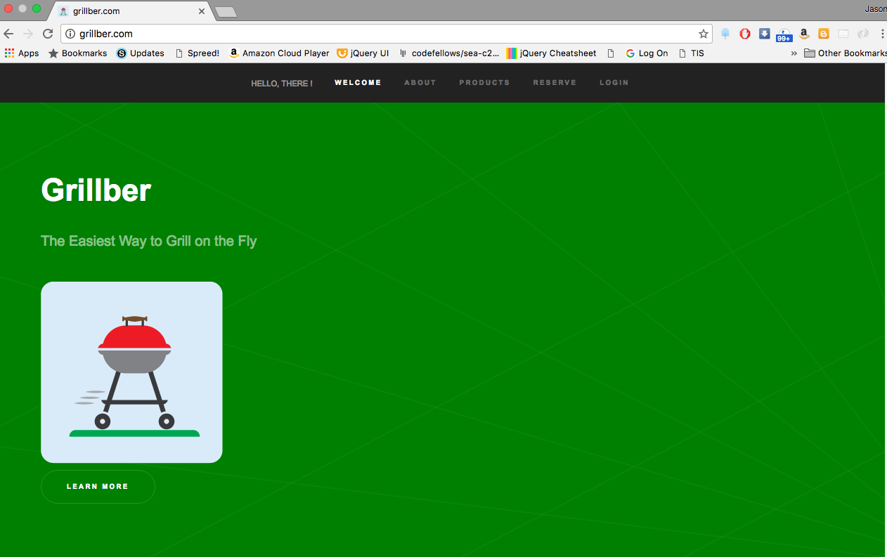
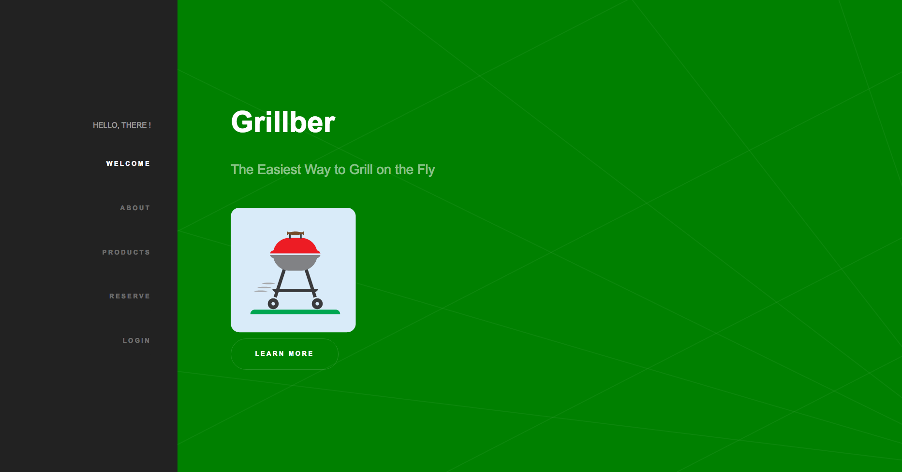
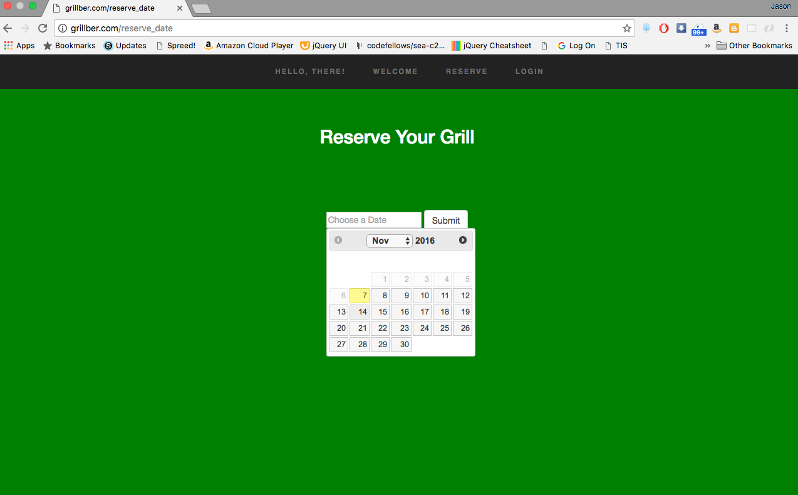

# Grillber  

www.grillber.com

##Contents

####Overview 
####Technologies
####Challenges and Solutions 
####MVP 
####Stretch Goals
####Contributors 
####Screenshots

###Overview 
Grillber is a grill rental service offering a selection of Big Green Eggs available for daily rental.  Customers are able to select from three models, depending on their needs, by choosing a date and size based on available inventory.  Payment is accepted via Stripe API.  Customer can manage their reservations through a customer account portal.  Likewise, the owner can manage all customer reservations through an owner portal.

###Technologies 
The following technologies and APIs were used:
HTML
CSS
Bootstrap
jQuery
Javascript
Python 
Flask
Jinja 2
PostGreSQL/PyGreSQL
WSGI
Stripe API

###Challenges and Solutions
 
#####1. Prioritizing functionality vs styling
During the planning stage of the build, we identified baseline features, some of which potentially needed styling as part of testing for functionality.  Initially we added heavy styling via a bootstrap template from “##”, which provided a structure for testing initial features.  We experienced a loss of efficiency by simultaneously trying to implement styling alongside new features.  For example, we had envisioned a one-page app but as we added a more robust reservation system, customer account portal, and owner portal, it became clear that separate pages were needed.  Front-end features such as smooth scrolling were not applicable to subsequent pages and a separate layout scheme had to be developed accordingly. 
 
**Ultimately, we had two solutions:**  First we utilized the Scrum methodology to our advantage, as much of the small step planning that we had originally accounted for translated well into working efficiently through the hiccups of modifying the massive template styling files.  A small piece of functionality or back end work would be implemented (i.e. the reservation portal html file, and corresponding route in python), and then the front end team could work to style that smaller step, and incorporate it into the larger styling template.  Secondly, for the feature pages, a secondary layout.html file was created from which all of the added feature pages could extend.  This helped to drastically reduce the need to sort through the thousands of lines of CSS in the template, and allowed for more directed, efficient styling of those pages, as they were developed.
 
#####2. Splitting the team in half too early in the project.
During the first day, teammates gravitated toward front and back end roles, and kept those roles throughout the entirety of the build.  While this had the added benefits of equitably splitting the workload, and keeping the entire build moving forward simultaneously, it also meant that half of the team did not get to derive the same level of depth of experience as the other half in their respective focus.  
 
**Solution and plan for future team builds:**  Again, keeping the tasks relatively small in scope helped to create an effective means of communication between the front and back end pairs.  Periodic check in’s allowed for each respective pair to know exactly what step the other pair was working on, and allowed for an extremely flexible workflow.  Looking back we’d wished that we’d taken extra time to develop the core functionality together on that first day or two, such that all team members had more of a hand in, and deeper understanding of the underlying logic and structure of the app.  This would have allowed for more flexibility in team members jumping from front to back, and vice versa throughout the project.  Overall, we were pleased with our workflow, and the job of the respective team pairs, but would try a different initial approach in future builds.
 
#####3.  Inefficient initial design of the database.
Having found a program that assisted in helping to design the database table scheme, we initially tried using it to set up our prototype database.  While it did give us a means of visualizing the tables as we created the ones we believed that we would need, it proved to be a hindrance in much the same way the styling template was to our front end design.  We inadvertently added some tables which were unnecessary, failed to make appropriate connections for the upcoming queries, and made it harder for ourselves to begin implementing the page features.
 
**Solution:**  Take the time to think through the connections of the tables, and appropriate means by which to join them in queries.  Re-design tables as needed, and delete unnecessary ones.  Work through queries within the database interface as part of the designing process, and before attempting to implement the queries into the python file. Much of the functionality and the connection to the databases developed as we developed the feature pages, and there’s a certain amount of that to be expected.  While our tables went through several iterations, working in small steps helped to insure that we never met a serious back end road block that would have necessitated completely starting over.  Small changes here and there were very manageable, and again, allowed us to all keep the momentum and the build moving forward.
 
#####4: Remote development and GitHub merging.
While there were GitHub merging challenges that came as a direct result of working remotely outside of our class time together, there were GitHub issues that we faced, even as we were all gathered around one computer, trying to make sense of our pull requests and merge conflicts.  Working remotely outside of class, was a shift from the workflow experience of working together during the day, and the first couple of days were problematic for team members being unsure of what, and how much to work on certain elements of the build for fear of duplicating other work , or somehow corrupting the current master build. 
 
GitHub workflow had up until this point made sense in theory, but a day or two of excessive pull requests from multiple team mates, without a clear direction of how to properly move the build along at the same pace made for some scary moments and worry of losing a great deal of work.  There were equally frustrating moments of trying to determine how to deal with a difficult merge conflict.
 
**Solution:**  Both of these challenges resolved themselves over the course of the week, as we learned how to more effectively use Git pull requests, work from branches, and divy the work more thoughtfully as we worked simultaneously on certain aspects of the build.  In that way, the front end team’s work would become less likely to cause a merge conflict with the back end and vice versa.
 
In the same way, we learned to utilize Skype, and screen sharing to pair program remotely, which was just as efficient as being together in person.  This allowed us to begin to more effectively use our evening and weekend time as well.
 
#####5:  Determining whether the site is intuitive for users.
Having built the site, the features, links, description and flow all made sense to us, but we would take time periodically to think about how this would appear to a first time user of the site.  We did a decent amount of planning early on to try to account for this, and had several Scrum related stickies that were specific to making sure that the page itself was intuitive and that moving through the site would make sense to anyone.  That said, there were items that we had to revamp as we built the site, be it redirecting the user to a different part of the site to make the flow more helpful, removing certain buttons or options from view depending on whether a user was logged in,  or reworking the home page to provide for a clear sense of next steps.
 
 

###MVP
We wanted to create Grillber to be a basic, yet fully functional grill rental app and decided the following features were necessary to achieve that goal:
	•	Responsive, professional front-end site - First impressions are critical, so we knew that front-end design was essential for presenting Grillber.  The main page features an intuitive layout with sidebar navigation for desktop browsing top navbar for mobile navigation.  It also includes sections covering the basics of product overview and grill reservation, as well as links to the login and rental pages.  We also tested the design to ensure a seamless, mobile experience wherein we minimized the links on the navigation bar.
	•	Database designed to handle reservations - 
	•	Calendar and grill buttons - We used a jQuery UI calendar to allow our customers to select a date.  The date is passed to the database as a query which returns available grill sizes that populate on the website as buttons.  

###Stretch Goals 
We were able to meet one of our stretch goals: Adding Stripe as a payment method.  On further iterations of Grillber, we would implement the following:
	•	Option to buy add-on packages - These packages would include items such as food, tents, turf pads, and chairs to supplement customer events like tailgating or parties. 
	•	Delivery - The reservation system would handle scheduling for the delivery of grills with the possibility of scheduling grill pick-ups as well.  
	•	Social media integration - Setting up Grillber on sites such as Facebook, Twitter, and Instagram to allow customers to share stories and images of Grillber experiences.  
	•	Subscribe to promotions - Send a periodical newsletter with current promotions and sales, while also integrating social media narratives to promote Grillber.
	•	Owner search page - Allowing the owner to quickly navigate through the owner portal by implementing a search function.
	•	Confirmation email - Currently, flash alerts and rendered pages alert a customer as to the transactions on the site.  Confirmation emails would be sent to the user upon reservation and payment of a selected grill.
	•	Peer to peer rentals - Allowing for users to rent their grill on other users on Grillber, similar to the model of Airbnb.
	•	Additional styling - Create a fully functional, one page website where the logins and rentals are handled on the main page.

###Contributors 

Jason Campbell
Keyur Patel 
Dominic Zenon 
Autumn Coleman

###Screenshots

